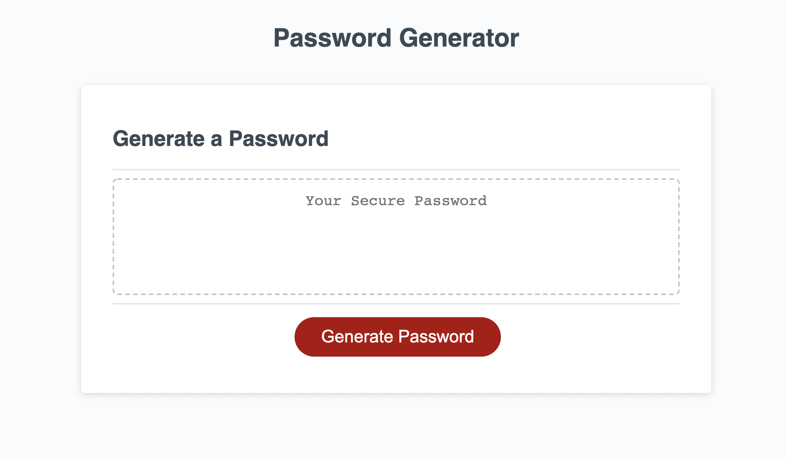
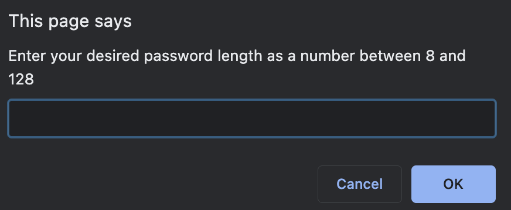

# homework03: Password Generator 

## Description
This is an application that enables the user within an organization to generate a random password based on the criteria that the user has selected. The application runs in the web browser and is powered by JavaScript. The randomly generated password is intended to provide a greater level of security to the user and the organization as a whole. 

## Table of Contents
* [Usage](#usage)
* [Credits](#credits)

## Usage

## Credits

[OWASP - Password Special Characters](https://owasp.org/www-community/password-special-characters)

